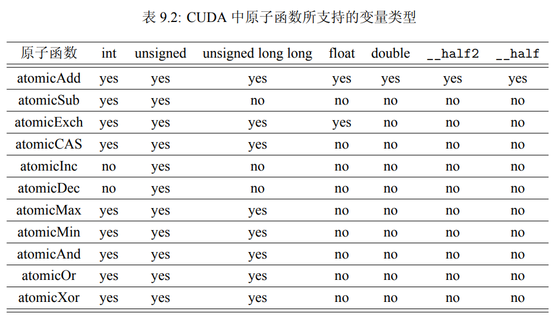

1. 加法：T atomicAdd(T *address, T val);
功能：new = old + val。
2. 减法：T atomicSub(T *address, T val);
功能：new = old - val。
3. 交换：T atomicExch(T *address, T val);
功能：new = val。
4. 最小值：T atomicMin(T *address, T val);
功能：new = (old < val) ? old : val。
5. 最大值：T atomicMax(T *address, T val);
功能：new = (old > val) ? old : val。
6. 自增：T atomicInc(T *address, T val);
功能：new = (old >= val) ? 0 : (old + 1)。
7. 自减：T atomicDec(T *address, T val);
功能：new = ((old == 0) || (old > val)) ? val : (old - 1)。
8. 比较-交换（Compare And Swap)：T atomicCAS(T *address, T compare, T val);
功能：new = (old == compare) ? val : old。
9. 按位与：T atomicAnd(T *address, T val);
功能：new = old & val。
10. 按位或：T atomicOr(T *address, T val);
功能：new = old | val。
11. 按位异或：T atomicXor(T *address, T val);
功能：new = old ^ val。

