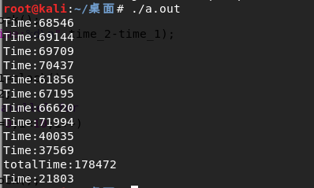

# The first try

```c
#include<time.h>
#include <stdio.h>
int main(int argc, char *argv[])
{
    int time1=clock(),time2;
#pragma omp parallel for
    for (int i = 0; i < 10000; i++)
    {
        printf("i = %d\n", i);
    }
    time2=clock();
    printf("%d",time2-time1);
    return 0;
}
```

I give it 12 threads, and compare to 1 thread.

I can't believe it, the left is 12Controllers and the right is only one.


So, parallel computing is not quickly done forever.

# The second try

Because the code with print to display, so this time, I will let it output only result

```c
#include<time.h>
#include <stdio.h>
int main(int argc, char *argv[])
{
    int time1=clock(),time2;
    int tmp=0;
#pragma omp parallel for
    for (int i = 0; i < 100000; i++)
    {
        tmp+=i;
        if(i%1000==0)
        printf("%d\n",i);
    }
    printf("i = %d\n", tmp);
    time2=clock();
    printf("%d",time2-time1);
    return 0;
}
```

As we guess, the result really good


because my CPU is very quick, so I have to increase 'i'

We can get the conclusion parallel output  use more time than we thought.

# Runtime counter

The codes I ran in Win10 before. Today I try to run it in kali Linux.

```C
#include<stdio.h>
#include<time.h>
void test(){
   	int t1 = clock();
    for(int i = 0 ; i < 100000 ; i++)
    {
        int j = i ;//For waste time
    }
    int t2 = clock();
    printf("Time:%d",t2-t1);
}
int main(){
    int t1 = clock();
    for(int i = 0 ; i < 2 ; i++)
    {
        test();
    }
    int t2 = clock();
    printf("totalTime:%d",t2-t1);
	test();
    return 0;
}
```

But the result looks wrong.


it use much time, and if we let ```test()``` run more times.



At first, I think they are fighting for only one Controller. But  in fact, Time counter is the real  error. OpenMPI has its counter.```double omp_get_wtime()```

 

Code:

```C
#include<stdio.h>
#include<omp.h>
void test(){
   	double t1 = omp_get_wtime();
    for(int i = 0 ; i < 100000 ; i++)
    {
        int j = i ;//For waste time
    }
    double t2 = omp_get_wtime();
    printf("Time:%lf",t2-t1);
}
int main(){
    double t1 = omp_get_wtime();
    for(int i = 0 ; i < 2 ; i++)
    {
        test();
    }
    int t2 = omp_get_wtime();
    printf("totalTime:%lf",t2-t1);
	test();
    return 0;
}
```

Well done is quickly done


So, in next OMP running, omp_get_wtime() is the best choice now;